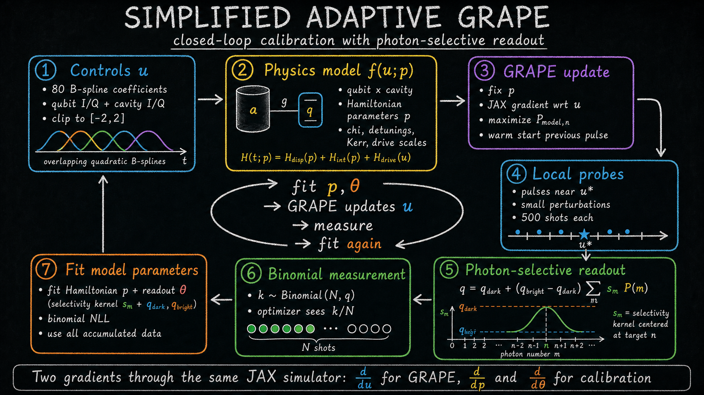

# Simplified Adaptive GRAPE

## A Short Course On The Method

This repository is a stripped-down research prototype for closed-loop Fock-state
preparation.

The basic idea is:

```text
use GRAPE to find a good pulse in a physics model
measure the real experiment near that pulse
fit the physics/readout model to the measurements
run GRAPE again with the calibrated model
repeat
```

The important point is that this is not a replacement of GRAPE by a generic
black-box optimizer. GRAPE is still the engine that updates the pulse. The
closed loop tries to make the model used by GRAPE less wrong.



The current code is intentionally concentrated in
`Simplified_adaptive_grape/`. The most complete notebook is
`Simplified_adaptive_grape/closed_loop_adaptive_grape.ipynb`.

---

## 1. What Is Observed

The hidden physical goal is to prepare a Fock state `|n>` in the cavity. For a
control pulse `u`, the ideal diagnostic quantity is

```text
P_true,n(u) = Pr(cavity has n photons after the pulse).
```

In the real experiment we do not directly observe `P_true,n`. We probe the
cavity through the qubit using a long photon-number-selective pulse, then read
out the qubit. The raw data is therefore a binary count:

```text
k successes out of N shots.
```

The optimizer sees `k/N`. The hidden simulator can also report `P_true,n`, but
that is only a diagnostic for the notebook.

---

## 2. The Control Pulse `u`

The pulse has 80 real coefficients:

```text
u in R^80 = 4 channels x 20 quadratic B-spline coefficients.
```

The four channels are:

```text
qubit I, qubit Q, cavity I, cavity Q.
```

The B-spline basis comes from the local `toolbox`. The first two and last two
basis functions are skipped, so all basis pulses have the same shape, the
control starts and ends at zero, and at most three quadratic B-splines overlap.

Every coefficient is clipped to the hardware-like range:

```text
-2 <= u_j <= 2.
```

GRAPE updates this vector `u`.

---

## 3. The Physics Model `p`

The differentiable simulator maps the controls and Hamiltonian parameters to a
final state:

```text
u, p -> final state -> P_model(m | u, p)
```

where `P_model(m | u, p)` is the full cavity photon-number distribution. The
target probability used by GRAPE is one component of that distribution:

```text
P_model,n(u, p) = P_model(m = n | u, p).
```

The current adaptive notebook fits six model parameters:

```text
chi shift
qubit frequency shift
cavity frequency shift
cavity self-Kerr
qubit drive amplitude factor
cavity drive amplitude factor
```

These are not fitted by comparing state vectors. They are fitted only through
the same binary readout data that the experiment would provide.

---

## 4. The Photon-Selective Readout Model

The readout is no longer modeled as a simple linear function of only
`P_model,n`. That is too restrictive: a real selective pulse can have finite
width, small detuning, imperfect contrast, and weak sensitivity to neighboring
photon numbers.

Instead, the notebook uses a small photon-number kernel. For each photon number
`m`, define

```text
s_m(theta)
  = eps + (1 - eps) exp[-0.5 ((m - (n_target + delta)) / sigma)^2].
```

Interpretation:

```text
delta  shifts the center of the selective readout
sigma  sets its photon-number width
eps    gives a weak off-target response
```

The predicted probability of observing a qubit-readout success is then

```text
q_model(u, p, theta)
  = q_dark
    + (q_bright - q_dark) sum_m s_m(theta) P_model(m | u, p).
```

The five fitted readout parameters are:

```text
q_dark    false-positive floor
q_bright  bright-readout probability
delta     selectivity-center shift
sigma     selectivity width
eps       off-target leakage
```

So the current calibration vector contains 11 fitted quantities:

```text
6 Hamiltonian/control-calibration parameters
+ 5 photon-selective readout parameters
= 11 fitted parameters.
```

The raw trainable variables are mapped through bounded transforms, mostly
`tanh`, so the fit stays in a reasonable physical range.

---

## 5. The Hidden True Experiment

The notebook has a hidden true simulator that plays the role of the hardware.
It deliberately differs slightly from the model used by GRAPE:

```text
slightly shifted chi
small qubit and cavity frequency shifts
small cavity self-Kerr
small drive miscalibrations
decay and dephasing in the open-system phase
```

The hidden readout uses the same photon-selective form, but with different
parameters and one extra offset:

```text
q_true(u)
  = q_dark,true
    + (q_bright,true - q_dark,true) sum_m s_m,true P_true(m | u)
    + offset_true.
```

In the current notebook,

```text
offset_true = 0.020.
```

The fitted model does not include this independent offset. This makes the
simulated experiment mildly misspecified, which is useful: if the method only
works when the model class is exactly true, it is probably too fragile.

The actual measured data is sampled as

```text
k ~ Binomial(N_shots, q_true(u)).
```

For the local probe pulses, the notebook currently uses `N_shots = 500`.

---

## 6. Two Learning Problems In One Loop

There are two gradients, both computed by JAX, but with respect to different
variables.

### GRAPE Updates The Controls

During GRAPE, the model parameters are fixed:

```text
fixed:      p, theta
optimized: u
```

The objective is essentially

```text
loss_control(u) = 1 - P_model,n(u, p) + pulse_penalty(u).
```

JAX differentiates this loss with respect to the 80 pulse coefficients. Each new
GRAPE run is warm-started from the previous good pulse.

### Calibration Updates The Model

During calibration, the measured controls and shot counts are fixed:

```text
fixed:      measured controls u_i, successes k_i, shots N_i
optimized: p, theta
```

For every measured pulse, the model predicts

```text
q_i = q_model(u_i, p, theta).
```

The fit minimizes the binomial negative log likelihood:

```text
loss_model(p, theta)
  = mean_i [
      - k_i log(q_i)
      - (N_i - k_i) log(1 - q_i)
    ] / N_i.
```

This is the right loss for shot data. It also lets the readout parameters and
Hamiltonian parameters learn together with the same optimizer.

---

## 7. Do We Reuse Old Measurements?

Yes. The closed-loop notebook accumulates all previous measurements:

```text
D_t = D_{t-1} union new measurements from round t.
```

The calibration mini-batches are drawn from the accumulated dataset, not only
from the newest local cloud. This is the natural default if the hardware is
stationary.

If the real device drifts during the run, the next thing to add would be a
sliding window or a time-decayed likelihood, so recent measurements matter more
than old ones.

---

## 8. The Closed-Loop Experiment

The notebook runs the following loop:

```text
initialize u, p, theta

for each round:

    1. GRAPE
       optimize u in the current calibrated model

    2. local probing
       generate nearby pulses around the optimized pulse
       run the hidden experiment with finite shots

    3. calibration
       fit p and theta on the accumulated shot data

    4. repeat from the best pulse found so far
```

The early phase uses unitary evolution for speed. The later phase switches to
open-system evolution with decay/dephasing. In the current simplified version,
the decay constants are used but not fitted.

---

## 9. How To Read The Diagnostics

The most important comparison is not a single curve. There are two distinct
questions.

### Does the model predict the measured readout?

This compares

```text
q_model(u, p, theta)
```

against the observed fraction

```text
k / N.
```

If this is bad, the calibrated model is not explaining the actual data seen by
the optimizer.

### Does the model predict the physical Fock population?

In simulation only, we can also compare

```text
P_model,n(u, p)  versus  P_true,n(u).
```

This tells us whether the model is learning the physical fidelity, not just the
readout response. On real hardware, this curve is hidden.

### Why plot log infidelity?

When fidelities get close to one, ordinary plots hide important differences.
For example, `0.99`, `0.999`, and `0.9999` are all visually near the top of a
linear probability plot. The useful scale is often

```text
log(1 - P_n).
```

---

## 10. Notebook Order

The simplified project is meant to be read in this order:

```text
1. Simplified_adaptive_grape/test_grape.ipynb
2. Simplified_adaptive_grape/adaptive_grape_parameter_fit.ipynb
3. Simplified_adaptive_grape/closed_loop_adaptive_grape.ipynb
```

`test_grape.ipynb` checks the basic GRAPE implementation and compares unitary
and non-unitary optimization.

`adaptive_grape_parameter_fit.ipynb` tests one local calibration problem:
optimize a pulse, probe nearby pulses, and fit model parameters from those
measurements.

`closed_loop_adaptive_grape.ipynb` is the current main experiment: alternate
GRAPE, local probing, and Hamiltonian/readout calibration.

---

## 11. Current Simplifications

The code is intentionally simple. The main simplifications are:

```text
local probe pulses are random perturbations, not optimal experimental design
the readout kernel is symmetric and Gaussian-like
the hidden readout has an offset not included in the fitted model
T1/T2 are used in open-system simulation but not fitted
old measurements are weighted equally, so drift is not modeled
```

These are good next places to improve if the closed loop works in simulation but
fails on hardware.

---

## 12. Running

From the repository root:

```bash
uv sync
```

Then open the notebooks in `Simplified_adaptive_grape/`.

The project includes the small local `toolbox/` subset used by the notebooks:
B-splines, quantum operators/states, and simple unitary/Lindblad evolution
helpers.
