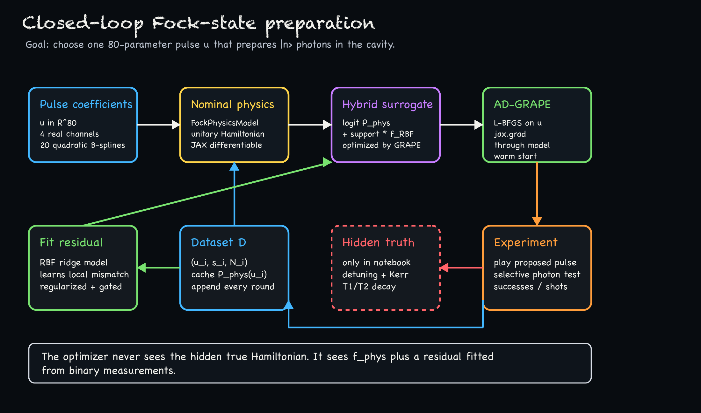
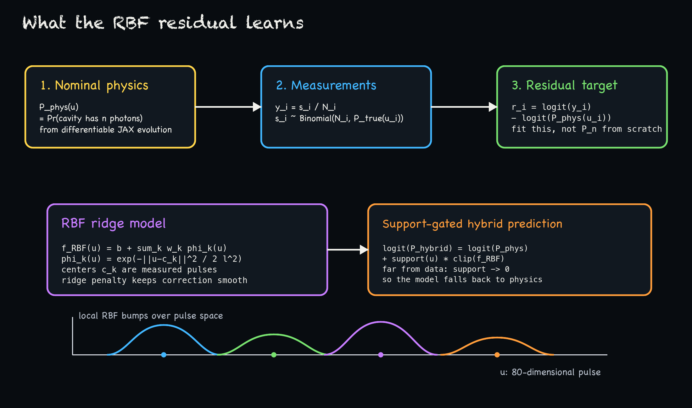
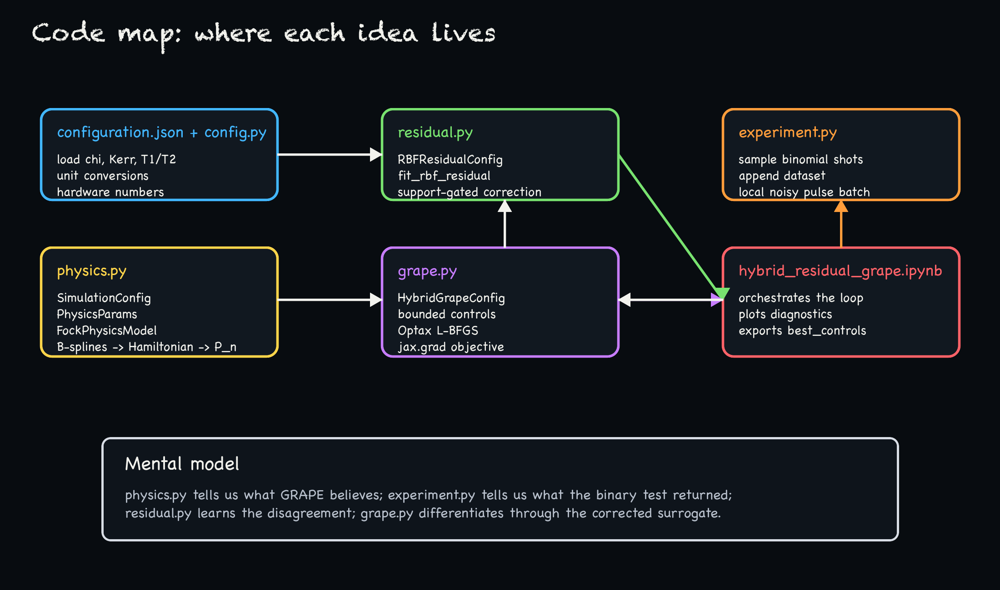
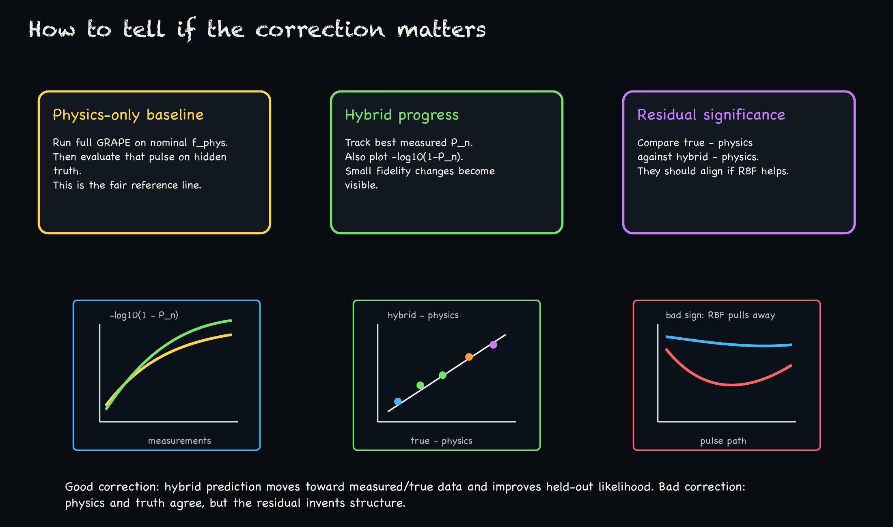

# Hybrid Residual GRAPE

This project is a small research sandbox for closed-loop preparation of a Fock state in a 3D cavity coupled to a qubit.

The target is simple to state:

```text
Find one pulse u that prepares |n> photons in the cavity.
```

The hard part is that the real experiment does not directly return the full quantum state. It only returns binary photon-number-test shots:

```text
1 = the cavity had exactly n photons
0 = it did not
```

So each candidate pulse gives a noisy estimate

```text
y = successes / shots ~= P_n(u)
```

where `P_n(u)` is the probability that the cavity contains `n` photons after the pulse.

This repository explores a hybrid strategy:

```text
use GRAPE gradients from a physics model
+ learn a small residual correction from binary measurements
+ re-run GRAPE through the corrected model
```



## The Big Idea

Plain GRAPE is powerful because it uses gradients through a differentiable simulator. But in the lab, the simulator is never perfect. There may be small detunings, drive calibration errors, missing Kerr terms, decay, dephasing, leakage, or other effects.

Pure black-box optimization is honest about the experiment, but it is data hungry in an 80-dimensional pulse space.

This code tries to sit between the two:

```text
P_hybrid(u) = physics prediction + learned local correction
```

More precisely, the code works in logit space:

```text
logit(P_hybrid(u)) =
    logit(P_phys(u)) + support(u) * f_RBF(u)
```

The physics model gives smooth gradients. The residual model learns where the physics prediction disagrees with measured data.

## What Is Being Optimized?

The control pulse is represented by 80 real numbers:

```text
4 real channels x 20 quadratic B-spline coefficients
```

The four channels are:

```text
qubit I
qubit Q
cavity I
cavity Q
```

The B-spline basis follows the feedback-GRAPE style: quadratic splines, first and last two skipped, so all basis pulses have the same shape shifted in time and the pulse starts and ends at zero. At most three basis functions overlap at any instant.

The optimizer does not directly edit waveform samples. It edits the B-spline coefficients `u`, then `physics.py` turns those coefficients into time-dependent qubit and cavity drives.

## The Physics Model

The nominal model lives in `src/hybrid_residual_grape/physics.py`.

It simulates the qubit-cavity system in the co-rotating/dispersive frame using JAX arrays and the local `toolbox/` quantum-mechanics utilities. The main class is:

```python
FockPhysicsModel
```

Its most important method is:

```python
photon_probability(controls) -> P_n
```

That returns the probability of finding exactly the target photon number in the cavity after applying the pulse.

The nominal model is the model GRAPE believes. In the notebook, there is also a hidden `true_model` used only to simulate the experiment. The hidden model can include small mismatches such as:

```text
chi offset
cavity detuning
qubit detuning
drive scale errors
cavity phase error
cavity self-Kerr
T1/T2 decay and dephasing
```

On real hardware, the hidden true model disappears and is replaced by OPX measurements.

## The Measurement Model

The experiment model lives in `src/hybrid_residual_grape/experiment.py`.

In the notebook, it does this:

```python
true_probability = true_model.population_probability(controls)
successes ~ Binomial(shots, true_probability)
```

This is meant to mimic what the real photon-number test gives:

```text
send pulse to OPX
run selective qubit pi pulse for photon number n
read out the qubit
repeat N times
return successes / N
```

The optimizer only gets the binomial data. The exact hidden `P_true` is plotted only for diagnostics in simulation.

## The RBF Residual

The residual model lives in `src/hybrid_residual_grape/residual.py`.

RBF means radial basis function. It is a smooth local interpolation model over the 80-dimensional pulse space.

For each measured pulse `u_i`, the code stores:

```text
u_i
successes_i
shots_i
P_phys(u_i)
```

Then it computes the residual target:

```text
r_i = logit(successes_i / shots_i) - logit(P_phys(u_i))
```

So the residual is not trying to learn the whole experiment from scratch. It is only trying to learn the mismatch between measured data and the physics model.



The fitted model has the form:

```text
f_RBF(u) = b + sum_k w_k exp(-||u - c_k||^2 / (2 l^2))
```

where the centers `c_k` are measured pulses.

The correction is support-gated:

```text
logit(P_hybrid) = logit(P_phys) + support(u) * clip(f_RBF(u))
```

This matters. Far from measured pulses, `support(u)` goes to zero, so the optimizer falls back to the nominal physics model instead of trusting a wild extrapolated correction.

## The GRAPE Step

The optimizer lives in `src/hybrid_residual_grape/grape.py`.

It runs L-BFGS on the B-spline coefficients. The objective is evaluated by:

```text
controls u
-> physics simulator P_phys(u)
-> RBF correction P_hybrid(u)
-> maximize P_hybrid(u)
```

Because the physics simulator and residual model are JAX functions, the code can use automatic differentiation:

```python
jax.grad(objective)
```

This is GRAPE in the practical sense: gradient-based pulse optimization through a differentiable quantum dynamics model. The optimization is warm-started from the previous best pulse, so each closed-loop round does not restart from zero.

## The Closed-Loop Algorithm

One round of the notebook does this:

```text
1. Fit the RBF residual from all accumulated measurements.
2. Run AD-GRAPE through physics + RBF.
3. Take the proposed pulse and local noisy variants.
4. Simulate or run binary photon-number measurements.
5. Append the results to the dataset.
6. Track the best high-shot measured pulse.
```

The full loop is in `hybrid_residual_grape.ipynb`.

## Code Map



The project is intentionally self-contained:

```text
configuration.json      copied experimental parameters
toolbox/                local quantum-mechanics helpers
src/hybrid_residual_grape/
    config.py           unit conversions and config loading
    physics.py          B-splines, Hamiltonian, state evolution, P_n
    residual.py         RBF/ridge residual correction
    grape.py            JAX/Optax L-BFGS pulse optimizer
    experiment.py       binomial measurement simulator
hybrid_residual_grape.ipynb
                        main tutorial and experiment notebook
```

No code imports from the older project folder.

## Running The Notebook

From the project root:

```zsh
uv sync
uv run jupyter lab hybrid_residual_grape.ipynb
```

The current `pyproject.toml` includes CUDA JAX because this was intended for DGX-style runs:

```toml
"jax[cuda12]"
```

If you run on a CPU-only laptop, you may need to remove the CUDA extra and use ordinary CPU JAX instead.

## How To Read The Results

The most important comparison is:

```text
physics-only GRAPE baseline
vs
closed-loop hybrid residual GRAPE
```

The baseline must be fair:

```text
1. Run a full GRAPE optimization on the nominal physics model only.
2. Pick the best nominal-model pulse.
3. Evaluate that pulse on the hidden true model.
```

If the physics-only pulse already reaches very high fidelity on the hidden true model, there may be little room for the RBF to help. That is a good result: it means the nominal physics model is already excellent.

At high fidelity, do not only look at `P_n`. Plot:

```text
-log10(1 - P_n)
```

because a change from `0.998` to `0.999` is visually tiny in `P_n`, but it halves the infidelity.



## How To Tell Whether The RBF Helped

The RBF is useful only if it learns a real, repeatable model mismatch.

Good signs:

```text
hybrid prediction fits measured data better than physics-only
hybrid - physics has the same sign as measured - physics
held-out measurement likelihood improves
best validated pulse improves over physics-only GRAPE
corrections happen where RBF support is high
```

Bad signs:

```text
physics and hidden truth agree, but RBF pulls away
RBF correction is large where support is low
training data fit improves but held-out measurements do not
the optimizer exploits the residual and proposes unsupported pulses
```

The notebook includes plots for exactly these questions.

## Why Add A Hidden Open-System Stress Test?

The notebook can deliberately make the hidden experiment harder than the nominal model. For example, the hidden simulator may include:

```text
cavity self-Kerr
T1/T2 decay
dephasing
small detunings
drive scale mismatch
```

while the nominal GRAPE model omits some of these. This tests whether the residual can learn that the real experiment is systematically worse or shifted relative to the model.

Important limitation: decay is not a coherent Hamiltonian error. An RBF residual can learn that certain pulses perform worse than the unitary model predicts, but it cannot undo photon loss. For that, the best solution is usually to include decoherence in the physics model or shorten/improve the pulse.

## Important Limitations

This is a research prototype, not a finished control stack.

Current simplifications:

```text
the qubit is modeled as two levels
qubit anharmonicity/leakage is not included
the RBF is a local correction, not a full replacement model
the true model exists only in simulation
hardware communication is represented by a Python function
```

To include qubit self-Kerr or transmon leakage, the simulator should be extended from a two-level qubit to at least a three-level transmon model.

## Suggested Next Experiments

Useful things to test next:

```text
1. Sweep mismatch strength:
   chi offset, detuning, drive scale, cavity phase, Kerr, T1/T2.

2. Add held-out validation:
   reserve some measured pulses and compare physics-only vs hybrid likelihood.

3. Fit physical nuisance parameters:
   chi, detuning, drive scale, phase, Kerr.
   This may generalize better than an 80D residual.

4. Use RBF only as a leftover correction:
   calibrated physics model first, residual second.

5. Validate best pulses with many shots:
   near 99.9%, shot noise can be comparable to the remaining infidelity.
```

## Regenerating The README Images

The README images are PNGs generated by ImageMagick:

```zsh
python3 docs/make_readme_images.py
```

They are intentionally not SVGs, and they are generated deterministically so labels stay accurate.
