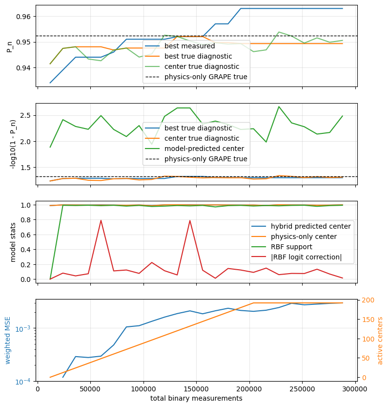
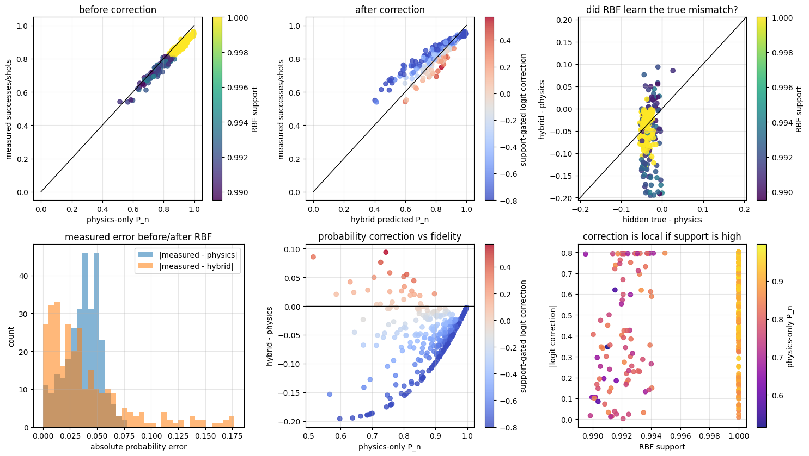
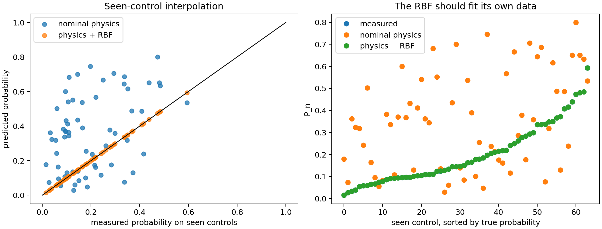
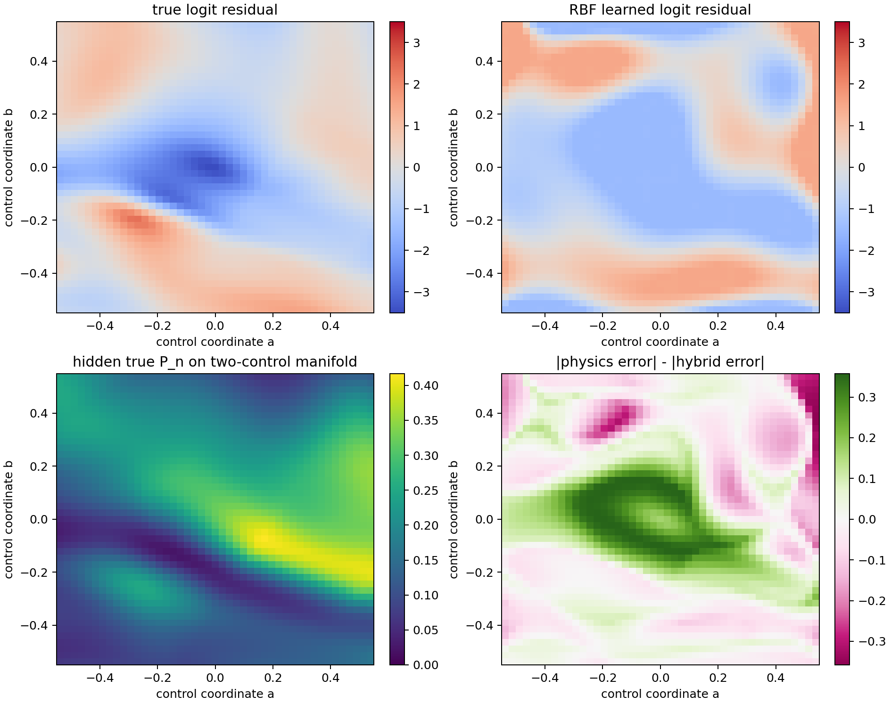
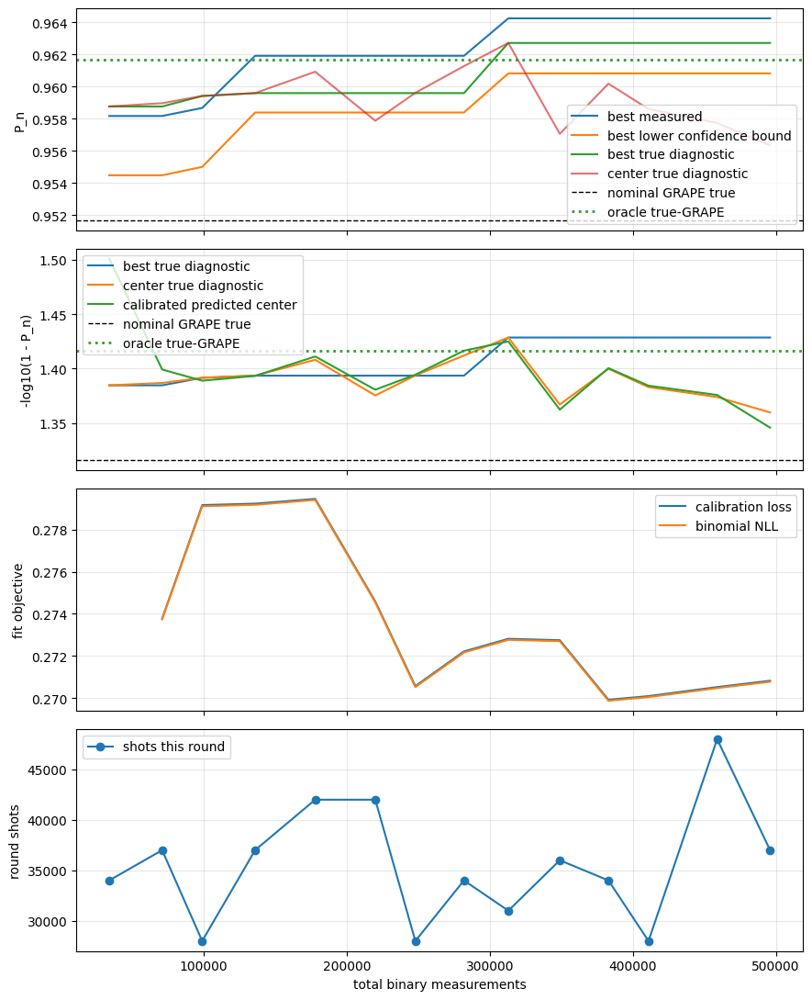
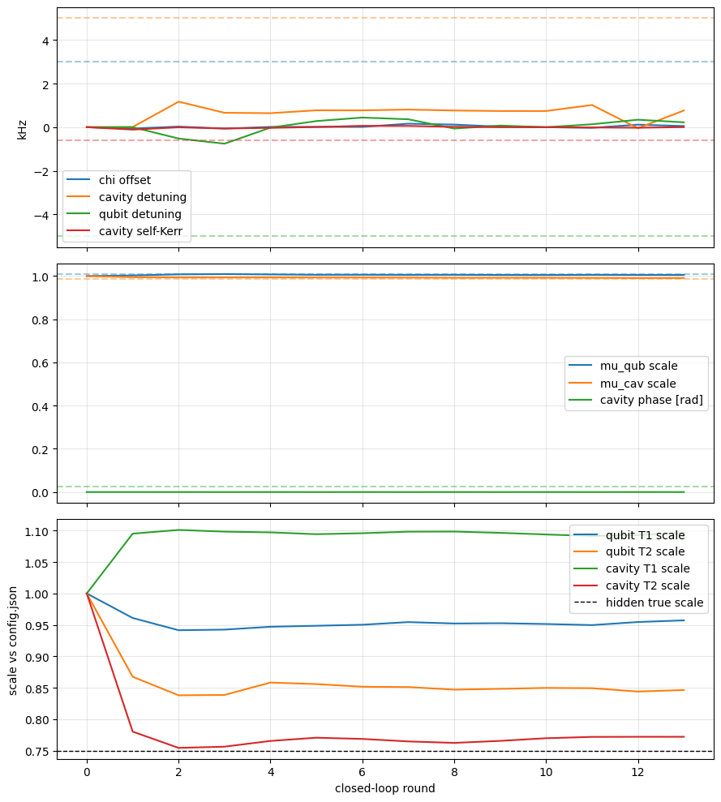
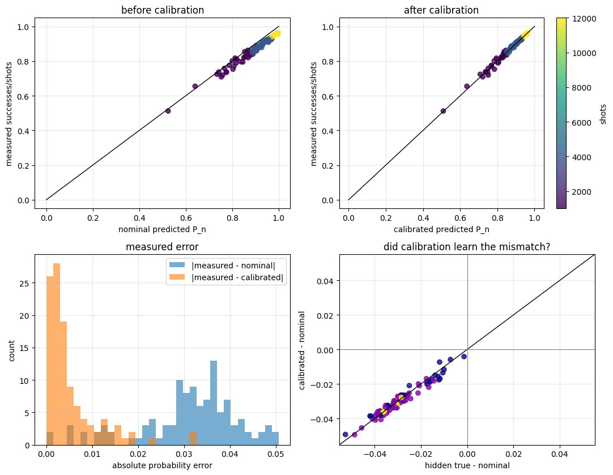

# Hybrid Residual GRAPE: Closed-Loop Fock-State Preparation

This repository explores closed-loop preparation of a cavity Fock state using a qubit-cavity control model and binary experimental feedback.

The physical goal is:

```text
prepare |n> photons in the 3D cavity with one shaped pulse
```

The experimental feedback is deliberately limited. For a pulse `u`, the experiment can only run a photon-number-selective qubit test and return binary outcomes:

```text
1 = the cavity had exactly n photons
0 = otherwise
```

After `N` repetitions, the measured reward is

```text
y = successes / N ~= P_n(u).
```

The main question of this project is:

> Can we use binary measurements to improve over GRAPE performed on an imperfect physics model?

There are currently two approaches in the repository:

1. **RBF residual GRAPE**: learn a flexible local residual correction on top of the physics model.
2. **Adaptive calibrated GRAPE**: fit a small set of physical nuisance parameters, then re-run GRAPE on the calibrated model.

The latest runs suggest that the second approach is much more promising.

## Quick Start

```zsh
cd ~/coding/hybrid_residual_grape
uv sync
```

Run the RBF residual notebook:

```zsh
uv run jupyter lab notebooks/01_rbf_residual_grape.ipynb
```

Run the calibrated-physics notebook:

```zsh
uv run jupyter lab notebooks/02_adaptive_calibrated_grape.ipynb
```

Run the RBF sanity-check notebook:

```zsh
uv run jupyter lab notebooks/03_rbf_sanity_checks.ipynb
```

The project is self-contained. It includes:

```text
configuration.json
toolbox/
src/hybrid_residual_grape/
```

No code imports from the older project folder.

## The Control Parameterization

The pulse is represented by 80 real parameters:

```text
u in R^80 = 4 real channels x 20 B-spline coefficients
```

The four real channels are:

```text
qubit I
qubit Q
cavity I
cavity Q
```

The waveform basis uses quadratic B-splines, with the first and last two splines skipped. This matches the feedback-GRAPE-style hardware-compatible parameterization:

```text
pulse starts and ends at zero
all basis functions have the same shape, shifted in time
at most 3 basis functions overlap at once
```

The optimizer never directly edits every waveform sample. It edits B-spline coefficients, then `physics.py` turns those coefficients into qubit and cavity drive envelopes.

## The Simulator

The core simulator is:

```python
FockPhysicsModel
```

defined in:

```text
src/hybrid_residual_grape/physics.py
```

Its central method is:

```python
photon_probability(controls) -> P_n
```

The simulator supports two evolution modes:

```text
no collapse operators       -> pure-state unitary evolution
T1/T2 collapse operators    -> density-matrix non-unitary evolution
```

The non-unitary path includes Lindblad-style T1/T2 decay and dephasing. This is slower, but it allows GRAPE to optimize through open-system dynamics.

In the notebooks, there are usually three models:

```text
physics_model       nominal model used by the pure-GRAPE baseline
calibrated_model    fitted physical model used by adaptive calibrated GRAPE
true_model          hidden simulator used only to mimic the real experiment
```

On hardware, `true_model` should disappear and be replaced by the OPX photon-number measurement.

## What Is Being Measured?

In simulation, the experiment is:

```python
P_true = true_model.population_probability(u)
successes ~ Binomial(shots, P_true)
```

In the real experiment, the same function should become:

```text
send pulse u to OPX
play pulse
apply long selective pi pulse for photon number n
read out qubit
repeat shots times
return successes
```

The optimizer only sees:

```text
u_i, successes_i, shots_i
```

The hidden `P_true` is only plotted in the notebook to debug the method.

## Notebook 1: RBF Residual GRAPE

Notebook:

```text
notebooks/01_rbf_residual_grape.ipynb
```

This was the first attempt at a model-based correction.

The idea was to keep the differentiable physics simulator, but add a learned correction:

```text
logit(P_hybrid(u)) = logit(P_phys(u)) + support(u) f_RBF(u)
```

The RBF model is trained on residuals:

```text
r_i = logit(y_i) - logit(P_phys(u_i))
```

where:

```text
y_i = successes_i / shots_i
```

The RBF correction is support-gated so it fades away far from measured pulses:

```text
support(u) -> 0  =>  P_hybrid(u) -> P_phys(u)
```

This was intended to prevent unsupported extrapolation.

### RBF Result

In the latest RBF run with hidden Kerr and T1/T2 effects, the method did **not** improve over pure GRAPE.

The key result was:

```text
physics-only GRAPE true P_n:       0.9524
RBF hybrid best true P_n:          0.9493
```

The calibration diagnostic also showed that the RBF made prediction error worse:

```text
measured MAE physics -> data:      0.0373
measured MAE hybrid  -> data:      0.0392

hidden true MAE physics -> true:   0.0361
hidden true MAE hybrid  -> true:   0.0391
```





### RBF Sanity Checks

The following checks were added after review:

```zsh
PYTHONPATH=. uv run python scripts/run_rbf_sanity_checks.py
```

If the project environment is already active, the same check can also be run as:

```zsh
PYTHONPATH=. python scripts/run_rbf_sanity_checks.py
```

or from:

```text
notebooks/03_rbf_sanity_checks.ipynb
```

The checks use a smaller Hilbert space so they run quickly. They are not meant
to be another final-fidelity benchmark; they isolate whether the RBF residual
behaves sensibly in the regimes where it should.

#### 1. Seen Controls

Question:

```text
Does the RBF predict correctly on controls that were already measured?
```

Answer: yes. On the synthetic seen-control check, the RBF fits its own measured
domain essentially exactly:

```text
seen physics MAE -> measured: 0.134890
seen hybrid  MAE -> measured: 0.000025

seen physics MAE -> true:     0.134897
seen hybrid  MAE -> true:     0.000110
```

This means the RBF implementation itself is not obviously broken. When the
query pulse is one of the measured pulses, the residual model can interpolate
the correction.



#### 2. Reduced Two-Control Space

Question:

```text
If the 80-dimensional pulse is restricted to two controls, does
misspecified physics + RBF beat misspecified physics?
```

Answer: yes, in this controlled low-dimensional setting. We restrict the pulse
to:

```text
u(a, b) = u0 + a d1 + b d2
```

and train the RBF on the two coordinates `(a, b)`, not on the full 80-vector.
On a held-out grid:

```text
low-dim test physics MAE -> true: 0.129580
low-dim test hybrid  MAE -> true: 0.096889
fraction of grid improved:       0.539753
```

So the review intuition is right: RBFs can help when the effective control
space is small and the residual is smooth enough.



#### Response To The Review

The physical-parameter residual is more expressive than the nominal model, but
it is still a physical model. It can only correct errors lying in the span of
the fitted parameters. For example, adding a fourth-order Kerr-like parameter
does not guarantee that we can compensate a wrong second-order Kerr estimate;
it may only mimic that error over a narrow pulse family. This is why the
calibrated-GRAPE model should be interpreted as a physically constrained local
calibration, not a universal misspecification corrector.

The RBF checks sharpen the diagnosis:

1. The RBF can fit measured controls.
2. The RBF can improve a deliberately misspecified model on a two-dimensional
   control manifold.
3. The RBF failed in the main 80-dimensional pulse search because the measured
   dataset is sparse relative to the raw control dimension, and because the
   residual depends on dynamical trajectory features, not just the final vector
   of B-spline coefficients.

So the current conclusion is not "RBFs are useless." It is:

```text
raw 80-dimensional RBF residuals are the wrong residual representation
for the full closed-loop GRAPE problem.
```

This supports the next direction: either fit identifiable physical parameters,
or use a residual model whose inputs are lower-dimensional physics-informed
features, such as transient qubit excitation, photon-number trajectory moments,
integrated drive power, or time-resolved sensitivity features from the
calibrated simulator.

### Interpretation

The RBF saw only the final pulse vector:

```text
u in R^80
```

and the final scalar reward:

```text
P_n(u)
```

But the missing physics is dynamical:

```text
T1 loss depends on time-integrated excitation
dephasing depends on time spent in sensitive superpositions
Kerr and detuning errors accumulate phase during the pulse
drive-scale errors distort the whole trajectory
```

So a raw 80-dimensional local interpolator was not the right object. It could fit local data, but did not generalize well enough to guide GRAPE.

The RBF notebook is still useful as a negative result and a diagnostic baseline.

## Notebook 2: Adaptive Calibrated GRAPE

Notebook:

```text
notebooks/02_adaptive_calibrated_grape.ipynb
```

This approach replaces the arbitrary RBF correction with a physically meaningful calibrated model.

Instead of learning:

```text
arbitrary correction over u in R^80
```

we fit a small number of physical nuisance parameters:

```text
chi offset
cavity detuning
qubit detuning
cavity self-Kerr
qubit drive scale
cavity drive scale
cavity phase
qubit T1/T2 scale
cavity T1/T2 scale
```

The calibrated model is then used inside GRAPE.

### Statistical Objective

The calibration uses the binomial likelihood of the measured data:

```text
successes_i ~ Binomial(shots_i, P_model(u_i; theta))
```

Equivalently, it minimizes the negative log-likelihood:

```text
L(theta) =
  - sum_i [
      successes_i log P_model(u_i; theta)
      + (shots_i - successes_i) log(1 - P_model(u_i; theta))
    ]
  + prior(theta)
```

The prior keeps parameters in a realistic range. For example, detunings are bounded to tens of kHz, drive-scale errors to a few percent, and lifetime scale factors stay near the values from `configuration.json`.

### Closed-Loop Algorithm

Each round does:

```text
1. Fit physical parameters theta from all accumulated measurements.
2. Build calibrated_model = FockPhysicsModel(q, theta).
3. Run GRAPE on calibrated_model.
4. Measure the proposed pulse and nearby noisy variants.
5. Allocate more shots to promising high-fidelity pulses.
6. Select the best pulse using a lower confidence bound.
```

The lower confidence bound avoids selecting a pulse only because it had a lucky binomial fluctuation.

### Unitary vs Non-Unitary Evolution

This is important.

The nominal baseline uses:

```text
physics_model with no T1/T2
=> unitary pure-state GRAPE
```

The true hidden experiment uses:

```text
true_model with T1/T2
=> non-unitary density-matrix evolution
```

The calibrated model also fits T1/T2 scale factors:

```text
calibrated_model with fitted T1/T2
=> non-unitary density-matrix GRAPE
```

So adaptive calibrated GRAPE is not merely evaluating decay after the fact. It optimizes the pulse through the non-unitary model once lifetimes are included.

This is slower than unitary GRAPE, but it is the correct direction if we want the optimizer to avoid trajectories that are unnecessarily exposed to qubit/cavity decay and dephasing.

## Adaptive Calibrated Result

The latest executed notebook showed a real improvement.

```text
nominal pure GRAPE true P_n:        0.95167
oracle true-GRAPE true P_n:         0.96165
adaptive calibrated GRAPE true P_n: 0.96272
```

The calibrated method improved over the nominal pure-GRAPE baseline by about:

```text
0.96272 - 0.95167 ~= 0.01105
```

or roughly a 1.1 percentage point absolute gain.

The calibration also dramatically improved model agreement with the simulated experiment:

```text
measured MAE nominal -> data:       0.03106
measured MAE calibrated -> data:    0.00528

hidden true MAE nominal -> true:    0.03056
hidden true MAE calibrated -> true: 0.00154
```

This is the most important evidence so far: the calibrated physical model is actually learning the mismatch, while the RBF residual did not.







## What Did We Learn?

### 1. Pure GRAPE is already strong

Even with an intentionally incomplete nominal model, pure GRAPE reached around:

```text
P_n ~= 0.952
```

on the hidden non-unitary experiment.

This means the baseline is not weak. Any closed-loop method has to beat a strong optimizer, not a random pulse search.

### 2. Raw RBF residuals are probably the wrong correction

The RBF residual was too unconstrained and too blind to the dynamics.

It only saw:

```text
u -> final scalar reward
```

but the errors depend on the trajectory:

```text
population vs time
phase accumulation vs time
qubit excitation vs time
cavity occupation vs time
```

So the next residual model should not be a generic RBF over the raw 80 coefficients.

### 3. Physical calibration is promising

The calibrated model improved both:

```text
prediction quality
final pulse fidelity
```

This suggests that a lot of the mismatch can be explained by low-dimensional physical parameters.

### 4. Shot allocation matters

Near high fidelity, binomial noise is comparable to the remaining error.

For example, with `P = 0.96` and `N = 1000`:

```text
std(y) = sqrt(P(1-P)/N) ~= 0.0062
```

That is large enough to select lucky pulses if we only look at raw `successes / shots`.

The adaptive notebook therefore uses:

```text
cheap shots for exploration
more shots for promising pulses
lower confidence bound for best-pulse selection
```

## What If The True Experiment Is Not Captured By These Parameters?

That is likely in the real experiment. The physical calibration model is still only an approximation.

The next layer should probably not be another RBF over raw pulse coefficients. A better residual would use **trajectory features** computed from the calibrated model.

For example:

```text
P_calibrated(u)
integral cavity population dt
integral qubit excitation dt
maximum cavity population
maximum qubit excitation
pulse energy
pulse smoothness
time center-of-mass of cavity population
time center-of-mass of qubit excitation
```

Then a small residual model could learn:

```text
P_experiment(u) - P_calibrated(u)
```

from physically meaningful features rather than from raw 80-dimensional controls.

This would let the model learn effects like:

```text
pulses that populate the cavity too early suffer more loss
pulses that leave the qubit excited too long suffer more T1
certain high-power pulse shapes cause distortions not in the Hamiltonian model
```

That is probably the right next step if calibrated GRAPE saturates below the desired fidelity.

## Code Map

```text
src/hybrid_residual_grape/
  config.py        load configuration.json and unit conversions
  physics.py       B-splines, Hamiltonian, unitary/non-unitary evolution, P_n
  experiment.py    binomial measurement simulator
  residual.py      RBF/ridge residual model
  calibration.py   physical-parameter calibration and adaptive shot logic
  grape.py         JAX/Optax L-BFGS pulse optimization

notebooks/
  01_rbf_residual_grape.ipynb
    RBF residual experiment

  02_adaptive_calibrated_grape.ipynb
    physical calibration + adaptive GRAPE experiment

  03_rbf_sanity_checks.ipynb
    targeted RBF interpolation and low-dimensionality checks

scripts/
  run_rbf_sanity_checks.py
    reproducible version of the RBF sanity checks
```

## Current Recommendation

The current best direction is:

```text
1. Continue with adaptive calibrated GRAPE.
2. Increase oracle true-GRAPE effort to estimate the real ceiling.
3. Increase shots for final pulse validation.
4. Add held-out measurement likelihood for calibration.
5. If needed, add a small trajectory-feature residual model on top of calibrated physics.
```

I would not invest further in the raw RBF residual unless it is only used as a very local diagnostic tool.
